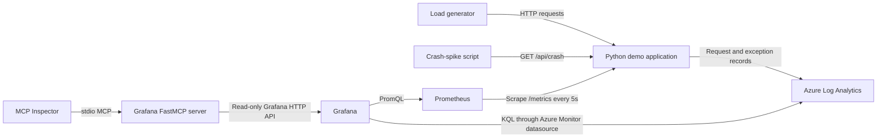

# Grafana MCP Demo Runbook

This runbook starts the complete local demo, generates normal and failure traffic, opens MCP
Inspector, and stops the environment. Run commands from the repository root:

```powershell
cd E:\AI\repos\TestProject
```

## Architecture



| Component | Purpose | Local URL |
|---|---|---|
| Demo application | Produces metrics, request logs, and controlled failures | `http://localhost:8000` |
| Prometheus | Scrapes and stores application metrics | `http://localhost:9090` |
| Grafana | Displays application telemetry | `http://localhost:3000` |
| Load generator | Continuously calls the application | No published port |
| Azure Log Analytics | Stores request and application-event records | Azure portal |
| Grafana FastMCP | Exposes read-only Grafana tools, resources, and prompts | stdio |

The Docker services share the private `observability` network. Prometheus reaches the application at
`demo-app:8000`; it does not scrape through Azure or the host's published port.

## Prerequisites

- Docker Desktop or Docker Engine with Compose
- Python 3.10 or newer
- `uv`
- A local `.env` containing the Azure and Grafana values described in `.env.example`

Never commit `.env` or access tokens.

Create or refresh the Python environment:

```powershell
uv sync --extra dev
```

## Start all components

Start the application, load generator, Prometheus, and Grafana:

```powershell
docker compose up --build -d
docker compose ps
```

Wait until `demo-app` reports `healthy`, then open:

- Grafana dashboard: `http://localhost:3000/d/demo-app-overview`
- Prometheus targets: `http://localhost:9090/targets`
- Application health: `http://localhost:8000/healthz`

The Compose load generator automatically sends one normal request per second and occasional HTTP 500
responses. Watch its output with:

```powershell
docker compose logs -f load-generator
```

## Inject load manually

Generate 50 successful requests:

```powershell
1..50 | ForEach-Object {
    Invoke-RestMethod "http://localhost:8000/api/work?delay_ms=100" | Out-Null
}
```

Generate 20 handled HTTP 500 responses:

```powershell
1..20 | ForEach-Object {
    Invoke-WebRequest "http://localhost:8000/api/work?fail=true" -SkipHttpErrorCheck | Out-Null
}
```

Generate a controlled unhandled-exception spike:

```powershell
.\scripts\invoke-crash-spike.ps1 -Count 30 -DelayMilliseconds 100
```

The crash-spike script produces correlated `/api/crash` HTTP 500 metrics and `RuntimeError`
`UnhandledException` records. In Grafana, watch **HTTP 5xx spike by route**. Azure Log Analytics can
take several minutes to index the corresponding records.

Query the exception events with:

```kusto
DemoApplicationEvents_CL
| where TimeGenerated > ago(15m)
| where EventType == "UnhandledException"
| project TimeGenerated, ExceptionType, Message, RequestId, StackTrace
| order by TimeGenerated desc
```

## Start MCP Inspector

MCP Inspector starts the Grafana FastMCP server itself. Do not separately run `fastmcp run` for the
same Inspector session.

In PowerShell:

```powershell
cd E:\AI\repos\TestProject
.\.venv\Scripts\Activate.ps1
$env:PYTHONUTF8 = "1"
fastmcp dev inspector src\grafana_mcp\server.py:mcp --no-reload
```

In Command Prompt:

```bat
cd /d E:\AI\repos\TestProject
call .venv\Scripts\activate.bat
fastmcp dev inspector src\grafana_mcp\server.py:mcp --no-reload
```

Open the URL shown by Inspector, normally `http://localhost:6274`, and enable the server connection
toggle. Inspector should display seven tools, four resources, one resource template, and three prompts.

For Copilot, `.copilot/mcp-config.json` contains a ready-to-edit `grafana-mcp` stdio configuration
for `http://localhost:3000/`. Replace `PASTE_GRAFANA_SERVICE_ACCOUNT_TOKEN_HERE` locally with a
Grafana Viewer service-account token. Never commit the populated token.

## Stop the environment

Stop and remove the demo containers and network while retaining Prometheus and Grafana volumes:

```powershell
docker compose down
```

Confirm everything is stopped:

```powershell
docker compose ps
```

To stop containers without removing them:

```powershell
docker compose stop
```

To also delete stored Prometheus and Grafana data, use the destructive cleanup command:

```powershell
docker compose down -v
```

Stop MCP Inspector separately by pressing `Ctrl+C` in its terminal.
